# Sprint 0 — 프로젝트 스캐폴딩

---

## 1. 이번 스프린트에서 하려는 것

### 1.1 Sprint 0의 목적

코드를 작성하기 전에 **모듈 단위에 대한 정의와 각 모듈의 연결구조**를 확정하는 것이 Sprint 0의 핵심이다.
<br><br><br>
OpenClaw 코드를 분석하면서 코드 구현 의도를 파악하고 이해하며 따라가면서 구축해보기로 했다.

OpenClaw는 언뜻 보기엔 메신저 → LLM → 도구 실행 → 응답이라는 단순한 파이프라인 같지만,

실제로는 **설정**, **세션**, **라우팅**, **프롬프트 조립**, **보안 정책** 같은 횡단 관심사가 곳곳에 얽혀 있었다.


이것들을 초반에 분리하지 않으면 추후 기능을 붙일 때마다 기존 코드를 뜯어고쳐야 한다.
<br><br><br>
따라서 Sprint 0에서는 전체 뼈대를 만드는데에 집중하기로 했다.
<br><br><br>

### 1.2 만들어야 할 것과 이유

| 산출물 | 왜 필요한가 |
|---|---|
| **핵심 타입 (`types.ts`)** | 모든 모듈이 주고받는 데이터의 형태를 먼저 정의해야 한다.<br> `InternalMessage`가 확정되지 않으면 세션 스토어, 에이전트 러너, 채널 어댑터가 제각각 다른 구조를 만들게 된다. |
| **Tools 인터페이스 + 4개 Tool** | Sprint 2의 "Tool 사용" 시나리오가 Runner loop와 강하게 결합된다.<br> 도구의 입출력 인터페이스(`AgentTool`)가 미리 확정되어야 Runner가 어떻게 Tool을 호출하고 이력관리를 어떤 방식으로 할 지  설계할 수 있다. <br>4개 도구(`read`, `write`, `exec`, `web_fetch`)는 OpenClaw 분석에서 가장 빈번하게 쓰이는 최소 세트로, <br>이것만 있으면 파일 작업 + 명령 실행 + 웹 조회가 모두 가능하다. |
| **설정 스키마 + 로더** | LLM API 키, Telegram 봇 토큰, 보안 정책(denylist) 등은 <br>JSON5 파일 + 환경변수 Override로 설정되게 해둬야 Telegram/OpenAI를 연결할 때 설정 관련 코드를 새로 만들 필요가 없다. |
| **세션 스토어** | 이전대화 히스토리를 남길 수 있어야 한다.<br> SQLite를 고려중인데 파일 하나로 배포가 끝나고, WAL 모드로 읽기/쓰기 동시성도 충분하기 때문이다. |
| **라우터** | 같은 Telegram 봇이라도 그룹 채팅에서는 사용자별로 세션을 분리해야 한다. `channel:chatId:senderId` → `SessionKey` 변환 규칙을 정리해둬야 세션 스토어와 채널 어댑터가 같은 키를 사용할 수 있다. |
| **에이전트 러너 골격** | LLM 호출 → tool_calls 확인 → 도구 실행 → 결과를 이력에 추가 → 다시 LLM 호출<br> 위 루프가 이 프로젝트의 핵심이다. <br>루프 자체의 구조(최대 반복, 에러 처리, 토큰 누적)를 미리 설계해두고 `LLMClient` 구현체를 나중에 삽입하자. |
| **시스템 프롬프트 빌더** | 워크스페이스 파일(`SOUL.md`, `TOOLS.md`)을 읽어서 프롬프트를 조립하는 로직.<br> 페르소나·컨텍스트 관리와 서브에이전트(`minimal` 모드)가 모두 이 빌더 위에 올라가야한다. |
| **Tool 레지스트리 + Skill 레지스트리** | Tool 목록과 Skill(프롬프트 + Tool 정책 묶음)을 Map으로 관리하는 패턴.<br>나중에 특정 Skill이 특정 Tool(`exec` 등)을 못 쓰게 한다거나 어떤 특정 서브에이전트에게는 `sessions_spawn`을 제한하는 등의 정책을 코드 변경 없이 적용하기 위한 기초 구조. |

### 1.3 모듈 분리 기준과 이유

OpenClaw 코드를 읽으면서 어떤 기준으로 모듈을 나눴고 왜 그렇게 했는지 나름대로 추측해서 분리했다.

#### 분리 원칙: 변경의 이유가 달라지면 모듈을 나눈다.

| 모듈 | 분리 이유 |
|---|---|
| **`types.ts` (전역)**<br>vs<br>**`tools/types.ts` (도구 전용)** | 전역 타입(`InternalMessage`, `LLMClient`)은 거의 변하지 않지만, <br>Tool 타입(`AgentTool`, `ToolContext`)은 도구가 추가될 때마다 확장된다.<br> 변경 빈도가 다르므로 분리. |
| **`config/schema.ts`**<br>vs<br>**`config/loader.ts`** | 스키마(무엇을 검증할지)와 로더(어디서 읽어올지)는 독립적으로 변한다.<br>예를 들어 Redis에서 설정을 읽겠다고 하는 경우면 loader만 바꾸고 schema는 그대로 둘 수 있다. |
| **`tools/read.ts`, `write.ts`, `exec.ts`, `web-fetch.ts`** 각각 별도 파일 | Tool마다 의존성(fs, child_process, fetch)과 보안 정책이 달라야한다.<br>`exec`에는 denylist가 필요하고 `read`에는 경로 탈출 방어가 필요하다. |
| **`agents/runner.ts`**<br>vs<br>**`agents/system-prompt.ts`** | Runner는 어떻게 루프를 도는지 정의하고, 프롬프트 빌더는 LLM에게 전달할 프롬프트를 정의한다.<br>서브에이전트가 추가되면 프롬프트 빌더에 `minimal` 모드가 생기지만, 러너 루프 자체는 바뀌지 않는다. |
| **`sessions/store.ts`** 독립 | 세션 저장소를 SQLite에서 PostgreSQL이나 Redis로 바꿀 가능성이 있다고 생각했다.<br> 스토어 인터페이스(append, getHistory, clearSession)만 유지하면 구현체를 통째로 교체할 수 있다. |
| **`channels/types.ts`**<br>인터페이스만 우선 정의 | 우선은 Telegram 구현체만 만들지만, `ChannelAdapter` 인터페이스를 확정해야 main.ts와 에이전트 러너의 인터페이스도 확정될 수 있다.<br>Discord/Slack 어댑터를 추가할 때도 이 인터페이스만 구현하면 된다. |
| **`skills/types.ts`** 별도 모듈 | Tool 레지스트리와 Skill 레지스트리는 비슷한 패턴(Map + register/get)이지만 역할이 다르다.<br>Skill은 프롬프트 오버레이 와 Tool의 허용/거부 정책의 묶음이고, Tool은 단순히 실행 가능한 함수다.<br> |

#### 분리하지 않은 것과 이유

| 하나로 둔 것 | 이유 |
|---|---|
| **`utils/logger.ts` + `utils/token-counter.ts`** → 같은 `utils/` 폴더 | 둘 다 순수 유틸리티로, 다른 모듈에 의존하지 않고 상태도 없다.<br>복잡해질 이유가 없어서 폴더 하나로 충분하다. |
| **`router/router.ts`** 함수 2개만 | 라우팅 규칙이 단순(문자열 결합)해서 클래스로 만들 이유가 없다.<br>복잡해지면(예: 그룹별 정책, 화이트리스트) 그때 확장하면 된다. |
| **`main.ts`** 하나의 엔트리포인트 | 부트스트랩 순서(설정 → 도구 → 세션 → 채널 → 서버)가 명확하고, 여기서만 모든 모듈이 조립된다. |

### 1.4 연결 구조 설계 방향

모듈 간 연결 구조에 대한 원칙은 SOLID를 따르되 적당히 편의성도 챙기기 위해 4가지로 정했다.

**① 단방향 의존성** — 위에서 아래로만 의존한다.

```
main.ts
  → channels (Sprint 1)
    → agents
      → tools
      → sessions
        → types (최하위)
```

`tools`가 `agents`를 알거나, `sessions`가 `channels`를 아는 일은 없다.<br>이렇게 하면 하위 모듈을 단독으로 테스트할 수 있다.<br>실제로 OpenClaw도 `tests/tools.test.ts`는 에이전트나 세션 없이 도구만 독립 테스트한다.
<br><br><br>

**② 인터페이스 기반 결합** — 타입스트립트 인터페이스에 의존한다.

- `AgentRunner`는 `LLMClient` **인터페이스**에 의존한다. OpenAI든 Anthropic이든 `chat()` 메서드만 있으면 된다.
- `AgentRunner`는 `AgentTool` **인터페이스**에 의존한다. read/write/exec 중 어떤 도구든 `execute()` 메서드만 있으면 된다.
- `main.ts`는 `ChannelAdapter` **인터페이스**를 통해 채널을 연결한다. Telegram이든 Discord든 `start(onMessage)` 만 구현하면 된다.

인터페이스의 구현체만 만들면 기존 코드 변경 없이 기능이 추가될 것으로 생각했다.
<br><br><br>

**③ 레지스트리 패턴으로 확장** — Tool이나 Skill을 추가할 때 코드 수정을 최소화한다.

새 Tool을 만들어도 최소한의 코드 변경으로 적용이 가능해야 한다.<br>에이전트 러너나 프롬프트 빌더는 레지스트리에서 가져다 쓰므로 변경할 필요가 없다.
<br><br><br>

**④ main.ts가 유일한 조립점** — 의존성 주입은 main.ts에서만 한다.

모든 모듈이 자기 의존성을 직접 생성하지 않고, main.ts가 생성해서 넘겨준다.<br>예를 들어 `runAgent()`는 `LLMClient`를 직접 만들지 않고 파라미터로 받는다.

---

## 2. 아키텍처 개요

### 2.1 Class UML — 영역별 분할

전체 구조를 5개 영역으로 구분하고, 각 영역에 대해 설명한다.
- Core Types
- LLM Interface
- Tool System
- Agent System
- Data · Config · Extension

#### 2.1.1 Core Types (`src/types.ts`)

메시지, 도구 호출 등 프로젝트 전역에서 참조하는 핵심 타입.

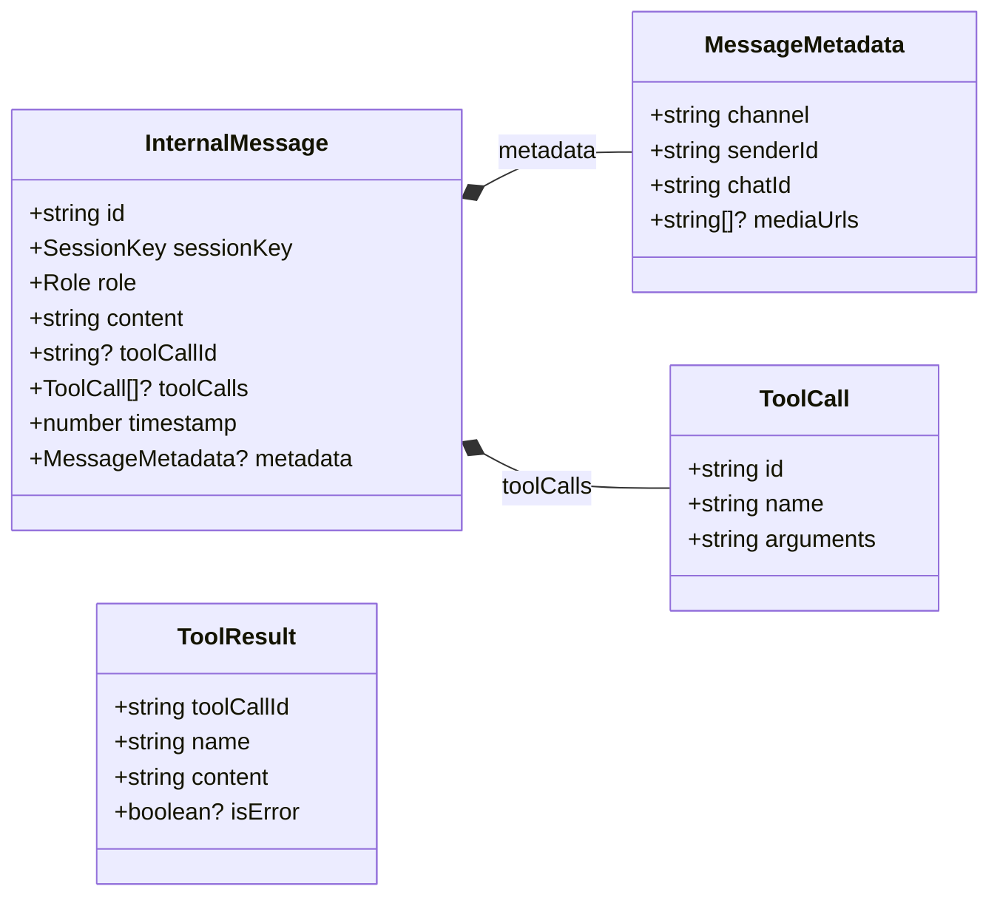

#### 2.1.2 LLM Interface (`src/types.ts`)

LLM 호출에 관련된 타입과 클라이언트 인터페이스.

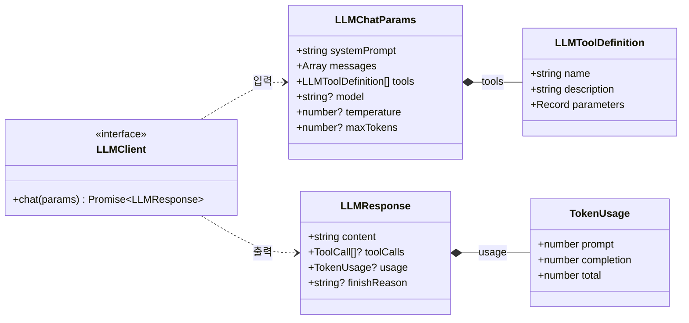

#### 2.1.3 Tool System (`src/tools/`)

`AgentTool` 인터페이스, 4개 구현체, `ToolRegistry` 관계.

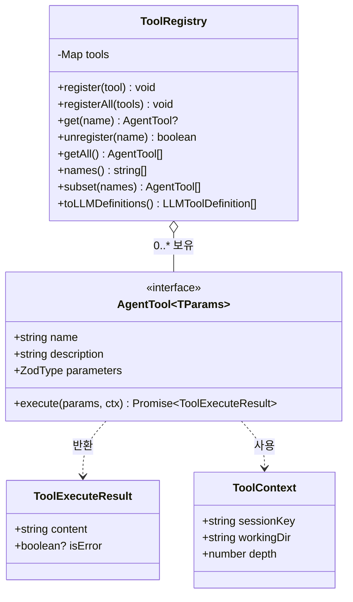

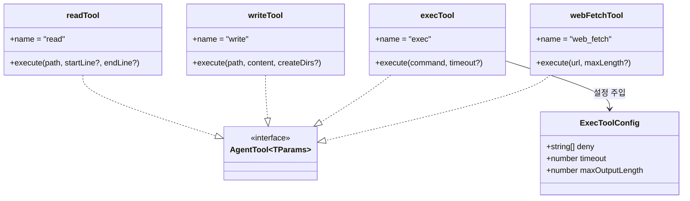

#### 2.1.4 Agent System (`src/agents/`)

에이전트 러너와 시스템 프롬프트 빌더.

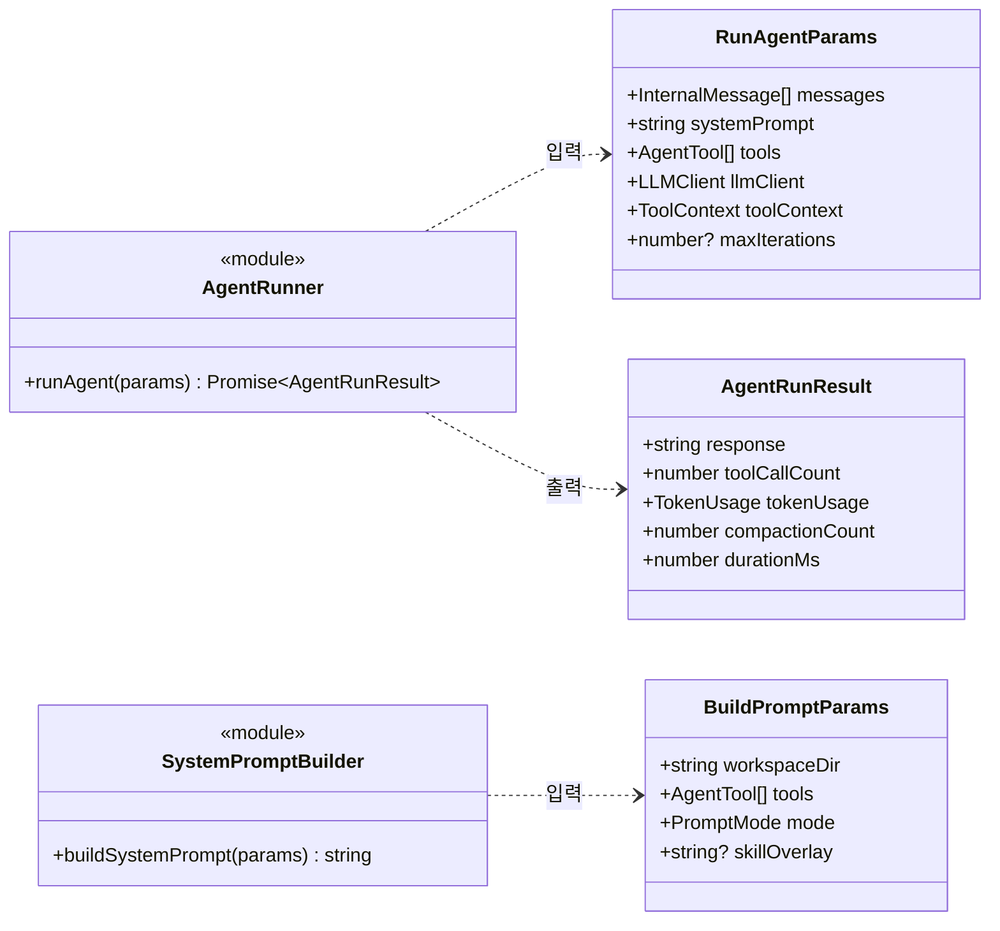

#### 2.1.5 Data · Config · Extension (`src/sessions/`, `config/`, `channels/`, `skills/`)

세션, 설정, 채널 어댑터, 스킬 — 나머지 모듈.

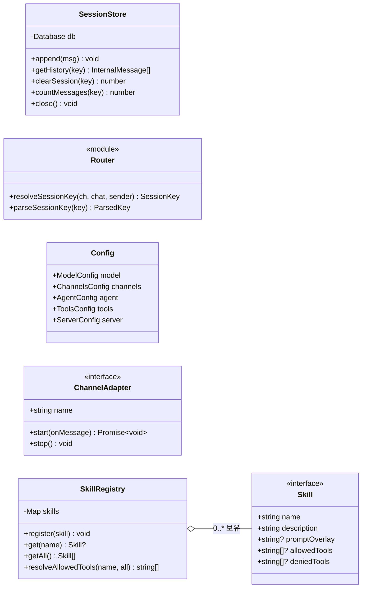

---

### 2.2 모듈 의존성 방향 (패키지 다이어그램)

> 실선 = Sprint 0에서 연결됨 · 점선 = Sprint 1 이후 연결 예정

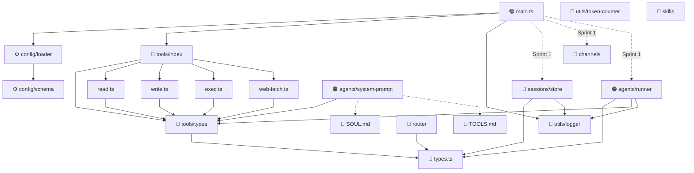

---

### 2.3 계층 구조 요약 (Layered View)

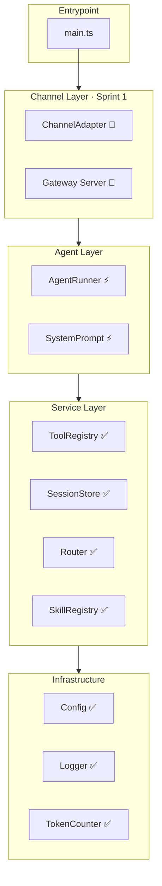

---

## 3. Sequence Diagrams

### 3.1 부트스트랩 시퀀스 (main.ts → 현재 상태)

현재 `main.ts`가 실행되면 아래 순서로 초기화된다.

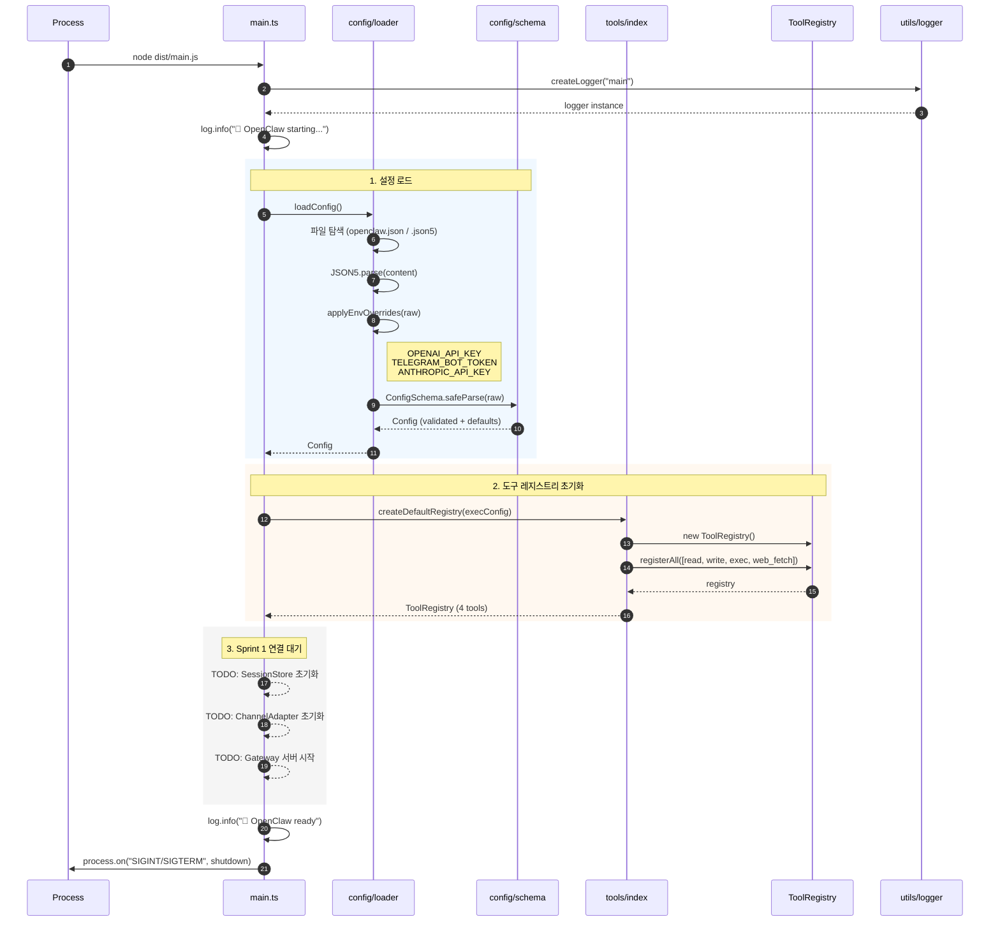

### 3.2 Agent Runner 루프 (핵심 실행 흐름)

`runAgent()`의 while 루프. 도구 호출이 포함된 전형적인 시퀀스.

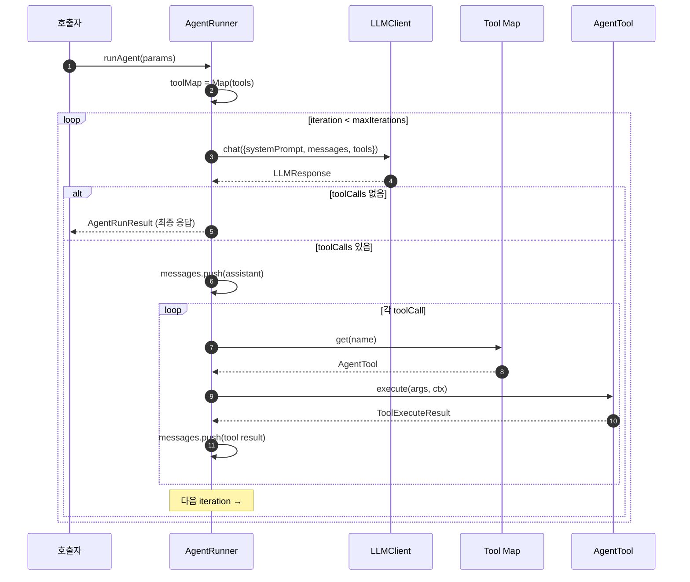

### 3.3 exec 도구 — 보안 + 실행

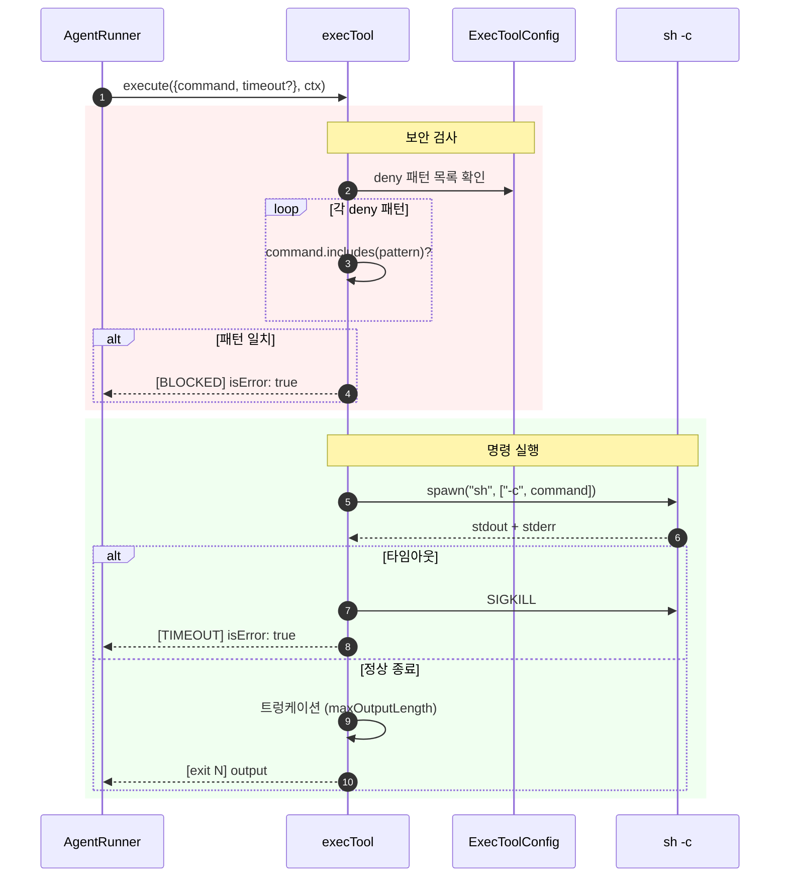

### 3.4 설정 로드 — 환경변수 Override

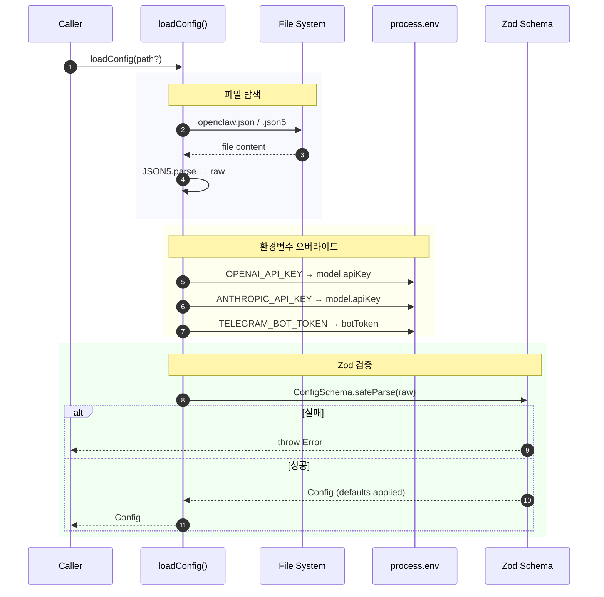

### 3.5 Session Store — CRUD

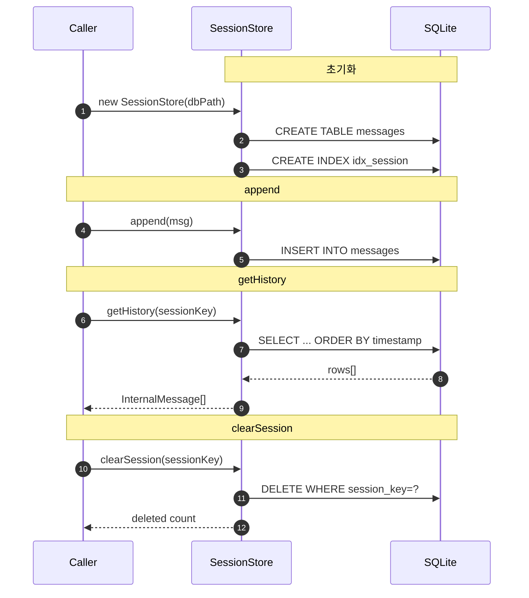

### 3.6 System Prompt 조립

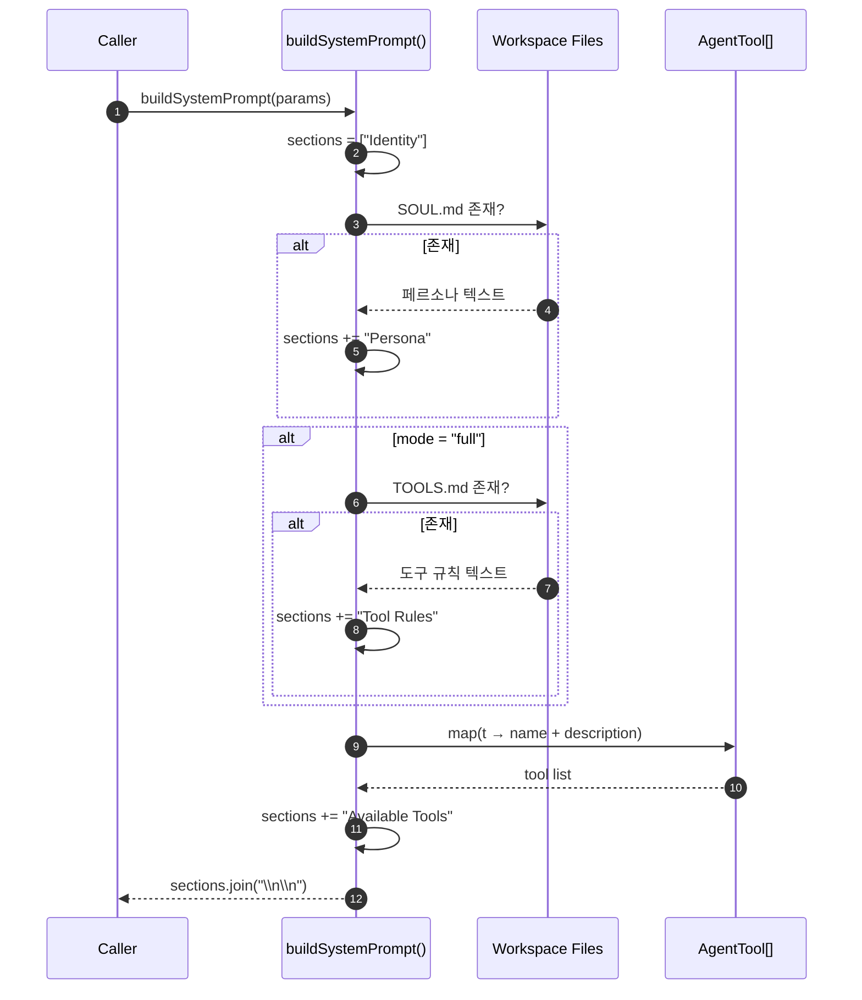

---

## 4. 핵심 연결 관계 요약

### 4.1 "누가 누구를 아는가" — 의존성 매트릭스

| 모듈 ↓ 가 → 를 사용 | types | tools | config | sessions | router | agents | utils | channels | skills |
|---|:---:|:---:|:---:|:---:|:---:|:---:|:---:|:---:|:---:|
| **main.ts** | | ✅ | ✅ | 🔜 | | 🔜 | ✅ | 🔜 | |
| **agents/runner** | ✅ | ✅ | | | | | ✅ | | |
| **agents/system-prompt** | | ✅ | | | | | | | |
| **tools/\*** | ✅ | ✅ (types) | | | | | | | |
| **sessions/store** | ✅ | | | | | | ✅ | | |
| **router/router** | ✅ | | | | | | | | |
| **config/loader** | | | ✅ (schema) | | | | | | |
| **skills/types** | | | | | | | | | |

> ✅ = Sprint 0에서 연결됨 | 🔜 = Sprint 1에서 연결 예정

### 4.2 데이터 흐름 방향

```
[설정 파일 + 환경변수]
        │
        ▼
    loadConfig() ──→ Config
        │
        ├──→ createDefaultRegistry(config.tools.exec) ──→ ToolRegistry
        │                                                     │
        │     ┌───────────────────────────────────────────────┘
        │     │
        ▼     ▼
    ┌─ main.ts ─┐     ← 현재 여기까지 연결됨
    │           │
    │  Sprint 1 │
    │     ▼     │
    │  Channel  │──→ Router ──→ SessionKey
    │  Adapter  │                   │
    │     │     │                   ▼
    │     │     │            SessionStore
    │     │     │                   │
    │     ▼     │                   ▼
    │  Agent    │◄── messages + systemPrompt + tools
    │  Runner   │
    │     │     │
    │     ▼     │
    │  LLMClient│──→ Tool 실행 ──→ 결과 반환
    │     │     │
    │     ▼     │
    │  응답 전송 │
    └───────────┘
```

---

## 5. 구현 산출물 목록

### 5.1 파일별 상태

| 파일 | 상태 | LOC | 역할 |
|---|---|---|---|
| `src/types.ts` | ✅ 완전 | 84 | 프로젝트 전역 핵심 타입 |
| `src/main.ts` | ⚡ 골격 | 45 | 엔트리포인트 (Sprint 1 TODO 3개) |
| `src/config/schema.ts` | ✅ 완전 | 86 | Zod 기반 설정 스키마 |
| `src/config/loader.ts` | ✅ 완전 | 79 | JSON5 파싱 + 환경변수 오버라이드 |
| `src/tools/types.ts` | ✅ 완전 | 121 | AgentTool 인터페이스 + ToolRegistry 클래스 |
| `src/tools/read.ts` | ✅ 완전 | 72 | 파일 읽기 도구 |
| `src/tools/write.ts` | ✅ 완전 | 57 | 파일 쓰기 도구 |
| `src/tools/exec.ts` | ✅ 완전 | 112 | 셸 명령 실행 도구 (보안 포함) |
| `src/tools/web-fetch.ts` | ✅ 완전 | 88 | URL 내용 가져오기 도구 |
| `src/tools/index.ts` | ✅ 완전 | 43 | Barrel export + createDefaultRegistry() |
| `src/agents/runner.ts` | ⚡ 골격 | 180 | 에이전트 while 루프 (LLM 연결 대기) |
| `src/agents/system-prompt.ts` | ⚡ 골격 | 60 | 프롬프트 조립 (full/minimal) |
| `src/sessions/store.ts` | ✅ 완전 | 112 | SQLite 세션 CRUD |
| `src/router/router.ts` | ✅ 완전 | 39 | SessionKey 생성/파싱 |
| `src/channels/types.ts` | 📐 인터페이스 | 31 | ChannelAdapter 인터페이스 |
| `src/skills/types.ts` | ✅ 완전 | 81 | Skill 인터페이스 + SkillRegistry |
| `src/utils/logger.ts` | ✅ 완전 | 20 | pino 로거 |
| `src/utils/token-counter.ts` | ✅ 완전 | 29 | 토큰 추정 (3자/토큰) |
| `openclaw.json5` | ✅ 완전 | 38 | 샘플 설정 파일 |
| `workspace/SOUL.md` | ✅ 완전 | 4 | 페르소나 정의 |
| `workspace/TOOLS.md` | ✅ 완전 | 7 | 도구 사용 규칙 |

> ✅ = 완전 구현 | ⚡ = 핵심 로직 구현 (외부 연결 대기) | 📐 = 인터페이스만

### 5.2 테스트

| 파일 | 테스트 수 | 대상 |
|---|---|---|
| `tests/config.test.ts` | 3 | 기본값, 부분 오버라이드, 잘못된 값 거부 |
| `tests/router.test.ts` | 2 | sessionKey 생성/파싱 |
| `tests/tools.test.ts` | 7 | 레지스트리 CRUD, 파일 읽기, 경로 탈출 차단, exec 실행, 위험 명령 차단 |
| `tests/skills.test.ts` | 3 | 스킬 등록, 도구 정책 resolve |

> ⚠️ Node.js 20+ 업그레이드 후 실행 가능

---

## 7. Sprint 1 진입 시 연결해야 할 것

현재까지의 상태로는 모듈들이 **독립적으로** 구성되어있다.

Sprint 1에서 아래 3개 연결이 이루어지면 메세지 수신에 의한 Trigger를 할 수 있을 것으로 생각된다.

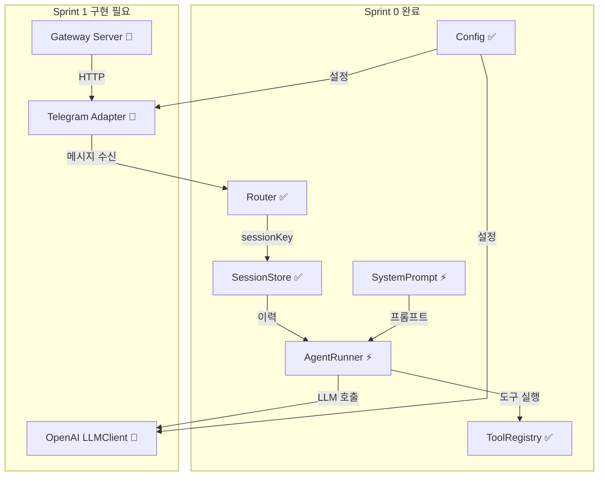
